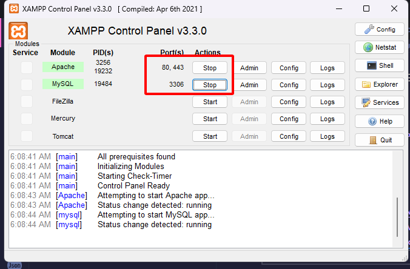
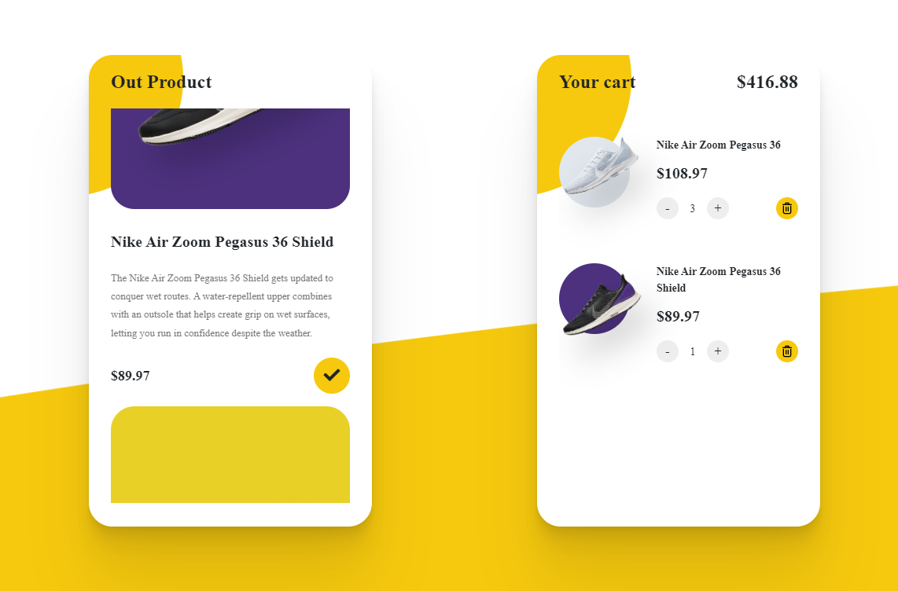

# Project: G_SNEAKER

Github Project: https://github.com/tanthuan031/G_SNEAKER_CART.git

### BackEnd: PHP core

- Php: 8.2

### FrontEnd: HTML,CSS,JAVASCRIPT,BOOTSTRAP4

## Setup Project

### 1. Install Xampp:

```
https://www.apachefriends.org/download.html
```

### 2. Copy project:

```
Disk your\xampp\htdocs\G_SNEAKER
```

### 3. Start Xampp:



### 42. Access url :

```
http://localhost/G_Sneaker/
```

---

UI PROJECT


---

TANTHUAN
